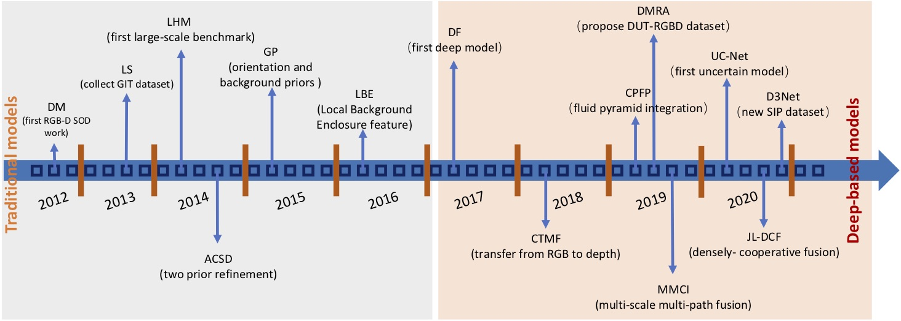
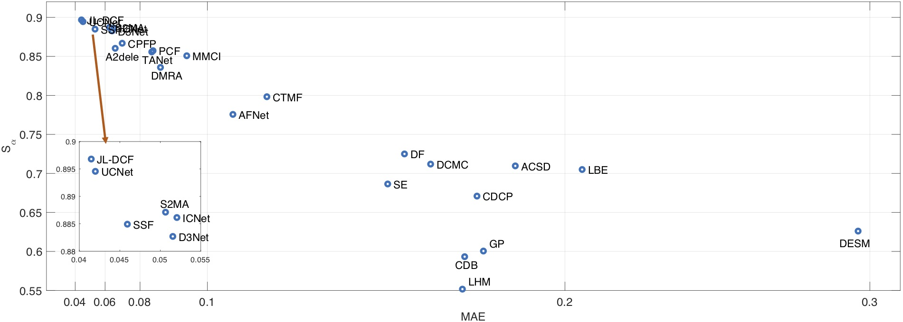
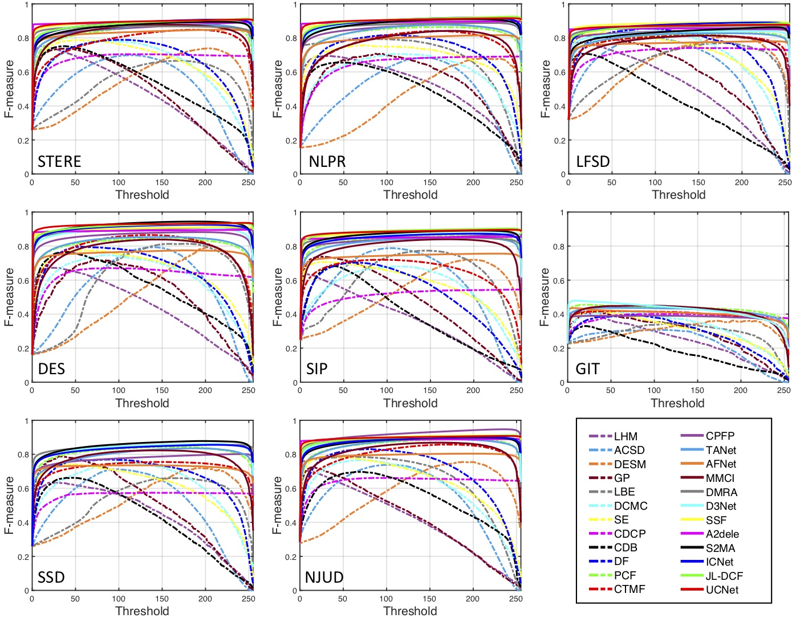

# RGB-D Salient Object Detection: A Survey

RGB-D Salient Object Detection: A Survey

Contributed by  [*Tao Zhou*](https://taozh2017.github.io), [*Deng-Ping Fan*](https://dpfan.net/).

--- *Last updated: 2020/07/26* --- 

------

## Content:

1. <a href="#survey"> Related Reviews and Surveys to SOD </a>
2. <a href="#RGBDmodels"> RGB-D SOD Models </a>
3. <a href="#LFmodels">  Light Field SOD Models </a>
4. <a href="#datasets"> RGB-D SOD Datasets </a>
5. <a href="#evaluation"> Evaluation </a>
    1. <a href="#overallevaluation">  Overall Evaluation: </a>
    1. <a href="#Attribute">  Attribute-based Evaluation: </a>

------

## Related Reviews and Surveys to SOD:  <a id="survey" class="anchor" href="#survey" aria-hidden="true"></a>  

**No.** | **Year** | **Pub.** | **Title** | **Links** 
:-: | :-: | :-: | :-  | :-: 
01 | 2015 | IEEE TIP   |  Salientobject detection: A benchmark | [Paper](https://arxiv.org/pdf/1501.02741.pdf)/Project
02 | 2018 | IEEE TCSVT |  Review of visual saliency detectionwith comprehensive information | [Paper](https://arxiv.org/pdf/1803.03391.pdf)/Project
03 | 2018 | ACM TIST   |  A review of co-saliency detection algorithms: Fundamentals,applications, and challenges | [Paper](https://arxiv.org/pdf/1604.07090.pdf)/Project
04 | 2018 | IEEE TSP   |  Advanced deep-learning techniques for salient andcategory-specific object detection: A survey| [Paper](https://ieeexplore.ieee.org/document/8253582)/Project
05 | 2018 | IJCV       |  Attentivesystems: A survey | [Paper](https://link.springer.com/article/10.1007/s11263-017-1042-6)/Project
06 | 2018 | ECCV       |  Salient Objects in Clutter: Bringing Salient Object Detection to the Foreground | [Paper](http://mftp.mmcheng.net/Papers/18ECCV-SOCBenchmark.pdf)/[Project](http://dpfan.net/socbenchmark/)
07 | 2019 | CVM        |  Salient object detection: A survey | [Paper](https://link.springer.com/content/pdf/10.1007/s41095-019-0149-9.pdf)/Project
08 | 2019 | IEEE TNNLS |  Object detection with deep learning: Areview | [Paper](https://arxiv.org/pdf/1807.05511.pdf)/Project
09 | 2019 | arXiv      |  Salient Object Detection in the Deep Learning Era-An In-Depth Survey | [Paper](https://arxiv.org/pdf/1904.09146.pdf)/[Project](https://github.com/wenguanwang/SODsurvey) 

------

## RGB-D SOD Models:  <a id="RGBDmodels" class="anchor" href="#RGBDmodels" aria-hidden="true"></a>  

**No.** | **Year** | **Model** |**Pub.** | **Title** | **Links** 
:-: | :-: | :-: | :-  | :-  | :-: 
88 | 2020 | PGAR   | ECCV          | Progressively Guided Alternate Refinement Network for RGB-D Salient Object Detection | Paper/[Project](https://github.com/ShuhanChen/PGAR_ECCV20)
87 | 2020 | ATSA   | ECCV          | Asymmetric Two-Stream Architecture for Accurate RGB-D Saliency Detection	| Paper/[Project](https://github.com/sxfduter/ATSA)
86 | 2020 | BBS-Net| ECCV          | BBS-Net: RGB-D Salient Object Detection with a Bifurcated Backbone Strategy Network | [Paper](https://arxiv.org/pdf/2007.02713.pdf)/[Project](https://github.com/zyjwuyan/BBS-Net)
85 | 2020 | CoNet  | ECCV          | Accurate RGB-D Salient Object Detection via Collaborative Learning | [Paper](https://arxiv.org/pdf/2007.11782.pdf)/[Project](https://github.com/jiwei0921/CoNet)
84 | 2020 | DANet  | ECCV          | A Single Stream Network for Robust and Real-time RGB-D Salient Object Detection | [Paper](https://arxiv.org/pdf/2007.06811.pdf)/[Project](https://github.com/Xiaoqi-Zhao-DLUT/DANet-RGBD-Saliency)
83 | 2020 | CMMS   | ECCV          | RGB-D salient object detection with cross-modality modulation and selection | [Paper](https://arxiv.org/pdf/2007.07051.pdf)/[Project](https://github.com/Li-Chongyi/cmMS-ECCV20)
82 | 2020 | CAS-GNN| ECCV          | Cascade graph neural networks for rgbd salient object detection | Paper/[Project](https://github.com/LA30/Cas-Gnn)
81 | 2020 | HDFNet | ECCV          | Hierarchical Dynamic Filtering Network for RGB-D Salient Object Detection | [Paper](https://arxiv.org/pdf/2007.06227.pdf)/[Project](https://github.com/lartpang/HDFNet)
80 | 2020 | CMWNet | ECCV          | Crossmodal weighting network for rgb-d salient object detection | [Paper](https://arxiv.org/pdf/2007.04901.pdf)/[Project](https://github.com/MathLee/CMWNet)
79 | 2020 | UC-Net | CVPR          | UC-Net: Uncertainty Inspired RGB-D Saliency Detection via Conditional Variational Autoencoders | [Paper](https://openaccess.thecvf.com/content_CVPR_2020/papers/Zhang_UC-Net_Uncertainty_Inspired_RGB-D_Saliency_Detection_via_Conditional_Variational_Autoencoders_CVPR_2020_paper.pdf)/[Project](https://github.com/JingZhang617/UCNet)
78 | 2020 | S2MA   | CVPR          | Learning selective self-mutual attention for RGB-D saliency detection | [Paper](https://openaccess.thecvf.com/content_CVPR_2020/papers/Liu_Learning_Selective_Self-Mutual_Attention_for_RGB-D_Saliency_Detection_CVPR_2020_paper.pdf)/[Project](https://github.com/nnizhang/S2MA)
77 | 2020 | SSF    | CVPR          | Select, supplement and focus for RGB-D saliency detection | [Paper](https://openaccess.thecvf.com/content_CVPR_2020/papers/Zhang_Select_Supplement_and_Focus_for_RGB-D_Saliency_Detection_CVPR_2020_paper.pdf)/[Project](https://github.com/OIPLab-DUT/CVPR_SSF-RGBD)
76 | 2020 | A2dele | CVPR          | A2dele: Adaptive and Attentive Depth Distiller for Efficient RGB-D Salient Object Detection | [Paper](https://openaccess.thecvf.com/content_CVPR_2020/papers/Piao_A2dele_Adaptive_and_Attentive_Depth_Distiller_for_Efficient_RGB-D_Salient_CVPR_2020_paper.pdf)/[Project](https://github.com/OIPLab-DUT/CVPR2020-A2dele)
75 | 2020 | JL-DCF | CVPR          | JL-DCF: Joint learning and densely-cooperative fusion framework for RGB-D salient object detection | [Paper](https://openaccess.thecvf.com/content_CVPR_2020/papers/Fu_JL-DCF_Joint_Learning_and_Densely-Cooperative_Fusion_Framework_for_RGB-D_Salient_CVPR_2020_paper.pdf)/[Project](https://github.com/kerenfu/JLDCF)
74 | 2020 | D3Net  |IEEE TNNLS     | Rethinking RGB-D salient object detection: models, datasets, and large-scale benchmarks | [Paper](https://arxiv.org/pdf/1907.06781.pdf)/[Project](https://github.com/DengPingFan/D3NetBenchmark)
73 | 2020 | RGBS   |MTAP           | Salient object detection for rgb-d images by generative adversarial network | [Paper](https://link.springer.com/article/10.1007/s11042-020-09188-8)/Project
72 | 2020 | GFNe   |IEEE SPL       | GFNet: Gate fusion network with res2net for detecting salient objects in RGB-D images | [Paper](https://ieeexplore.ieee.org/document/9090350)/Project
71 | 2020 | SDF   | IEEE TIP       | Improved saliency detection in RGB-D images using two-phase depth estimation and selective deep fusion | [Paper](https://ieeexplore.ieee.org/document/8976428)/Project
70 | 2020 | ICNet | IEEE TIP       | ICNet: Information Conversion Network for RGB-D Based Salient Object Detection| [Paper](https://ieeexplore.ieee.org/document/9024241)/[Project](https://github.com/MathLee/ICNet-for-RGBD-SOD)
69 | 2020 |Triple-Net | IEEE SPL   | Triple-complementary network for RGB-D salient object detection| [Paper](https://ieeexplore.ieee.org/document/9076277)/Project
68 | 2020 |ASIF-Net | IEEE TCYB    | ASIF-Net: Attention steered interweave fusion network for RGB-D salient object detection| [Paper](https://ieeexplore.ieee.org/document/8998588)/[Project](https://github.com/Li-Chongyi/ASIF-Net)
67 | 2020 |BiANet | IEEE TIP       | Bilateral Attention Network for RGB-D Salient Object Detection | [Paper](https://arxiv.org/pdf/2004.14582.pdf)/Project
66 | 2020 |PGHF   | IEEE Access    | Multi-modal weights sharing and hierarchical feature fusion for rgbd salient object detection | [Paper](https://ieeexplore.ieee.org/stamp/stamp.jsp?tp=&arnumber=8981965)/Project
65 | 2020 |cmSalGAN | IEEE TMM     | cmSalGAN: RGB-D Salient Object Detection with Cross-View Generative Adversarial Networks | [Paper](https://arxiv.org/pdf/1912.10280.pdf)/Project
64 | 2020 | CoCNN | PR             | CoCNN: RGB-D deep fusion for stereoscopic salient object detection | [Paper](https://www.sciencedirect.com/science/article/abs/pii/S0031320320301321)/Project
63 | 2020 | GFNet | Neurocomputing | A cross-modal adaptive gated fusion generative adversarial network for RGB-D salient object detection | [Paper](https://www.sciencedirect.com/science/article/abs/pii/S0925231220300904)/Project
62 | 2020 | AttNet| IVC            | Attention-guided RGBD saliency detection using appearance information | [Paper](https://www.sciencedirect.com/science/article/abs/pii/S0262885620300202)/Project
61 | 2020 | SSDF   |arXiv          | Synergistic saliency and depth prediction for RGB-D saliency detection | [Paper](https://arxiv.org/pdf/2007.01711.pdf)/Project
60 | 2020 |CAF    | arXiv          | Is depth really necessary for salient object detection? | [Paper](https://arxiv.org/pdf/2006.00269.pdf)/Project
59 | 2020 |DPANet | arXiv          | DPANet: Depth Potentiality-Aware Gated Attention Network for RGB-D Salient Object Detection | [Paper](https://arxiv.org/pdf/2003.08608.pdf)/Project
58 | 2019 | DSD   | JVCIR          | Depth-aware saliency detection using convolutional neural networks | [Paper](https://www.sciencedirect.com/science/article/pii/S104732031930118X)/Project
57 | 2019 | DMRA  | ICCV           | Depth-induced Multi-scale Recurrent Attention Network for Saliency Detection | [Paper](https://openaccess.thecvf.com/content_ICCV_2019/papers/Piao_Depth-Induced_Multi-Scale_Recurrent_Attention_Network_for_Saliency_Detection_ICCV_2019_paper.pdf)/[Project](https://github.com/jiwei0921/DMRA)
56 | 2019 | CPFP  | CVPR           | Contrast Prior and Fluid Pyramid Integration for RGBD Salient Object Detection | [Paper](https://openaccess.thecvf.com/content_CVPR_2019/papers/Zhao_Contrast_Prior_and_Fluid_Pyramid_Integration_for_RGBD_Salient_Object_CVPR_2019_paper.pdf)/[Project](https://github.com/JXingZhao/ContrastPrior)
55 | 2019 | EPM   | IEEE Access    | Co-saliency detection for rgbd images based on effective propagation mechanism | [Paper](https://ieeexplore.ieee.org/document/8849990)/Project
54 | 2019 | AFNet | IEEE Access    | Adaptive Fusion for RGB-D Salient Object Detection | [Paper](https://arxiv.org/pdf/1901.01369.pdf)/[Project](https://github.com/Lucia-Ningning/Adaptive_Fusion_RGBD_Saliency_Detection)
53 | 2019 | LSF   | arXiv          | CNN-based RGB-D Salient Object Detection: Learn, Select and Fuse | [Paper](https://arxiv.org/pdf/1909.09309.pdf)/Project
52 | 2019 | DGT   | IEEE TCYB      | Going from RGB to RGBD saliency: A depth-guided transformation model | [Paper](https://www.researchgate.net/publication/335360400_Going_From_RGB_to_RGBD_Saliency_A_Depth-Guided_Transformation_Model)/[Project](https://rmcong.github.io/proj_RGBD_sal_DTM_tcyb.html)
51 | 2019 | DCMF  | IEEE TCYB      | Discriminative cross-modal transfer learning and densely cross-level feedback fusion for RGB-D salient object detection | [Paper](https://ieeexplore.ieee.org/document/8820129)/Project
50 | 2019 | TANet | IEEE TIP       | Three-stream attention-aware network for RGB-D salient object detection | [Paper](https://ieeexplore.ieee.org/document/8603756)/Project
49 | 2019 | DCA   | IEEE TIP       | Saliency detection via depth-induced cellular automata on light field| [Paper](https://ieeexplore.ieee.org/document/8866752)/Project
48 | 2019 | MMCI  | PR             | Multi-modal fusion network with multi-scale multi-path and cross-modal interactions| [Paper](https://www.sciencedirect.com/science/article/abs/pii/S0031320318303054)/Project
47 | 2019 | PDNet | ICME           | Prior-model guided depth-enhanced network for salient object detection| [Paper](https://arxiv.org/pdf/1803.08636.pdf)/[Project](https://github.com/cai199626/PDNet)
46 | 2019 | CAFM  | IEEE TSMC      | Global and Local-Contrast Guides Content-Aware Fusion for RGB-D Saliency Prediction | [Paper](https://ieeexplore.ieee.org/document/8941002)/Project
45 | 2019 | DIL   | MTAP           | Salient object segmentation based on depth-aware image layering | [Paper](https://link.springer.com/article/10.1007/s11042-018-6736-4)/Project
44 | 2019 | TSRN  | ICIP           | Two-stream refinement network for RGB-D saliency detection | [Paper](https://ieeexplore.ieee.org/document/8803653)/Project
43 | 2019 | MLF   | SPL            | RGB-D salient object detection by a CNN with multiple layers fusion | [Paper](https://ieeexplore.ieee.org/document/8638984)/Project
42 | 2019 | SSRC  | Neurocomputing | Salient object detection for RGB-D image by single stream recurrent convolution neural network | [Paper](https://www.sciencedirect.com/science/article/abs/pii/S0925231219309403)/Project
41 | 2018 | CDB   | Neurocomputing | Stereoscopic saliency model using contrast and depth-guided-background prior | [Paper](https://www.sciencedirect.com/science/article/abs/pii/S0925231217317034)/Project
40 | 2018 | ACCF  | IROS           | Attention-Aware Cross-Modal Cross-Level Fusion Network for RGB-D Salient Object Detection | [Paper](https://ieeexplore.ieee.org/document/8594373)/Project
39 | 2018 | SCDL  | ICDSP          | Rgbd salient object detection using spatially coherent deep learning framework | [Paper](https://ieeexplore.ieee.org/document/8631584)/Project
38 | 2018 | PCF   | CVPR           | Progressively complementarityaware fusion network for RGB-D salient object detection | [Paper](https://openaccess.thecvf.com/content_cvpr_2018/papers/Chen_Progressively_Complementarity-Aware_Fusion_CVPR_2018_paper.pdf)/[Project](https://github.com/haochen593/PCA-Fuse_RGBD_CVPR18)
37 | 2018 | CTMF  | IEEE TCYB      | CNNs-based RGB-D saliency detection via cross-view transfer and multiview fusion | [Paper](https://ieeexplore.ieee.org/document/8091125)/[Project](https://github.com/haochen593/CTMF)
36 | 2018 | ICS   | IEEE TIP       | Co-saliency detection for RGBD images based on multi-constraint feature matching and cross label propagation | [Paper](https://arxiv.org/pdf/1710.05172.pdf)/Project
35 | 2018 | HSCS  | IEEE TMM       | HSCS: Hierarchical sparsity based co-saliencydetection for RGBD images | [Paper](https://arxiv.org/pdf/1811.06679.pdf)/[Project](https://github.com/rmcong/Results-for-2018TMM-HSCS)
34 | 2017 | ISC   | SIVP           | An integration of bottom-up and top-down salient cueson rgb-d data: saliency from objectness versus non-objectness | [Paper](https://arxiv.org/pdf/1807.01532.pdf)/Project
33 | 2017 | MCLP  | IEEE TCYB      | An iterative co-saliency framework for RGBD images | [Paper](https://arxiv.org/pdf/1711.01371.pdf)/Project
32 | 2017 | DF    | IEEE TIP       | RGBD Salient Object Detection via Deep Fusion | [Paper](https://arxiv.org/pdf/1607.03333.pdf)/[Project](https://pan.baidu.com/s/1Y-PqAjuH9xREBjfl7H45HA)
31 | 2017 | MDSF  | IEEE TIP       | Depth-Aware Salient Object Detection and Segmentation via Multiscale Discriminative Saliency Fusion and Bootstrap Learning | [Paper](https://ieeexplore.ieee.org/document/7938352)/[Project](https://github.com/ivpshu/Depth-aware-salient-object-detection-and-segmentation-via-multiscale-discriminative-saliency-fusion-)
30 | 2017 | MFF   | IEEE SPL       | RGB-D saliency object detection via minimum barrier distance transformand saliency fusion | [Paper](https://wanganzhi.github.io/papers/SPL17.pdf)/Project
29 | 2017 | TPF   | ICCVW          | A Three-Pathway Psychobiological Framework of Salient Object Detection Using Stereoscopic Technology | [Paper](https://ieeexplore.ieee.org/document/8265566)/Project
28 | 2017 | CDCP  | ICCVW          | An innovative salient object detection using center-dark channel prior | [Paper](https://openaccess.thecvf.com/content_ICCV_2017_workshops/papers/w22/Zhu_An_Innovative_Salient_ICCV_2017_paper.pdf)/[Project](https://github.com/ChunbiaoZhu/ACVR2017)
27 | 2017 | BED   | ICCVW          | Learning RGB-D Salient Object Detection using background enclosure, depth contrast, and top-down features | [Paper](https://openaccess.thecvf.com/content_ICCV_2017_workshops/papers/w40/Shigematsu_Learning_RGB-D_Salient_ICCV_2017_paper.pdf)/[Project](https://github.com/sshige/rgbd-saliency)
26 | 2017 | MFLN  | ICCVS          | RGB-D Saliency Detection by Multi-stream Late Fusion Network | [Paper](https://link.springer.com/chapter/10.1007/978-3-319-68345-4_41)/Project
25 | 2017 | M3Net | IROS           | M3Net: Multi-scale multi-path multi-modal fusion network and example application to RGB-D salient object detection | [Paper](https://ieeexplore.ieee.org/abstract/document/8206370)/Project
24 | 2017 | HOSO  | DICTA          | HOSO: Histogram of Surface Orientation for RGB-D Salient Object Detection | [Paper](https://ieeexplore.ieee.org/document/8227440)/Project
23 | 2016 | GM    | ACCV           | Visual Saliency detection for RGB-D images with generative mode | [Paper](https://link.springer.com/chapter/10.1007/978-3-319-54193-8_2)/Project
22 | 2016 | DSF   | ICASSP         | Depth-aware saliency detection using discriminative saliency fusion | [Paper](https://ieeexplore.ieee.org/document/7471952)/Project
21 | 2016 | DCI   | ICASSP         | Saliency analysis based on depth contrast increased | [Paper](http://sites.nlsde.buaa.edu.cn/~shenghao/Download/publications/2016/9.Saliency%20analysis%20based%20on%20depth%20contrast%20increased.pdf)/Project
20 | 2016 | BF    | ICPR           | RGB-D saliency detection under Bayesian framework | [Paper](https://ieeexplore.ieee.org/document/7899911)/Project
19 | 2016 | DCMC  | IEEE SPL       | Saliency detection for stereoscopic images based on depth confidence analysis and multiple cues fusion  | [Paper](https://ieeexplore.ieee.org/document/7457641)/[Project](https://github.com/rmcong/Code-for-DCMC-method)
18 | 2016 | SE    | ICME           | Salient object detection for RGB-D image via saliency evolution | [Paper](https://ieeexplore.ieee.org/document/7552907)/Project
17 | 2016 | LBE   | CVPR           | Local Background Enclosure for RGB-D Salient Object Detection| [Paper](https://www.cv-foundation.org/openaccess/content_cvpr_2016/app/S10-09.pdf)/[Project](http://users.cecs.anu.edu.au/~u4673113/lbe.html)
16 | 2016 | PRC   | IEEE Access    | Improving RGBD Saliency Detection Using Progressive Region Classification and Saliency Fusion| [Paper](https://ieeexplore.ieee.org/stamp/stamp.jsp?tp=&arnumber=7762806)/Project
15 | 2015 | SF    | CAC            | Selective features for RGB-D saliency | [Paper](https://ieeexplore.ieee.org/document/7382554)/Project
14 | 2015 | MGMR  | ICIP           | RGB-D saliency detection via mutual guided manifold ranking | [Paper](https://ieeexplore.ieee.org/document/7350882)/Project
13 | 2015 | SRD   | ICRA           | Salient Regions Detection for Indoor Robots using RGB-D Data | [Paper](http://www.cogsys.cs.uni-tuebingen.de/publikationen/2015/Jiang_ICRA15.pdf)/Project
12 | 2015 | DIC   | TVC            | Depth incorporating with color improves salient object detection | [Paper](https://link.springer.com/article/10.1007/s00371-014-1059-6)/Project
11 | 2015 | SFP   | ICIMCS         | Salient object detection in RGB-D image based on saliency fusion and propagation | [Paper](https://dl.acm.org/doi/10.1145/2808492.2808551)/Project
10 | 2015 | GP    | CVPRW          | Exploiting global priors for RGB-D saliency detection | [Paper](https://www.cv-foundation.org/openaccess/content_cvpr_workshops_2015/W14/papers/Ren_Exploiting_Global_Priors_2015_CVPR_paper.pdf)/[Project](https://github.com/JianqiangRen/Global_Priors_RGBD_Saliency_Detection)
09 | 2014 | ACSD  | ICIP           | Depth saliency based on anisotropic center-surround difference | [Paper](https://projet.liris.cnrs.fr/imagine/pub/proceedings/ICIP-2014/Papers/1569913831.pdf)/[Project](https://github.com/HzFu/DES_code)
08 | 2014 | DESM  | ICIMCS         | Depth Enhanced Saliency Detection Method | [Paper](http://dpfan.net/wp-content/uploads/DES_dataset_ICIMCS14.pdf)/Project
07 | 2014 | LHM   | ECCV           | RGBD Salient Object Detection: A Benchmark and Algorithms | [Paper](http://dpfan.net/wp-content/uploads/NLPR_dataset_ECCV14.pdf)/[Project](https://sites.google.com/site/rgbdsaliency/code)
06 | 2014 | SRDS  | ICDSP          | Salient region detection for stereoscopic images | [Paper](https://ieeexplore.ieee.org/stamp/stamp.jsp?tp=&arnumber=6900706)/Project 
05 | 2013 | SOS   | Neurocomputing | Depth really Matters: Improving Visual Salient Region Detection with Depth | [Paper](https://www.sciencedirect.com/science/article/abs/pii/S0925231213002981)/Project 
04 | 2013 | RC    | BMVC           | Depth really Matters: Improving Visual Salient Region Detection with Depth | [Paper](http://cdn.iiit.ac.in/cdn/cvit.iiit.ac.in/images/ConferencePapers/2013/cv_deepth-really.pdf)/Project 
03 | 2013 | LS    | BMVC           | An In Depth View of Saliency                                     | [Paper](http://www.cs.utah.edu/~thermans/papers/ciptadi-bmvc2013.pdf)/Project 
02 | 2012 | RCM   | ICCSE          | Depth combined saliency detection based on region contrast model | [Paper](https://ieeexplore.ieee.org/document/6295184)/Project 
01 | 2012 | DM    | ECCV           | Depth matters: Influence of depth cues on visual saliency        | [Paper](https://link.springer.com/content/pdf/10.1007/978-3-642-33709-3_8.pdf)/Project 

------

## Light Field SOD Models:  <a id="LFmodels" class="anchor" href="#LFmodels" aria-hidden="true"></a>  

------

## RGB-D SOD Datasets:  <a id="verallevaluation" class="anchor" href="#verallevaluation" aria-hidden="true"></a>  

------

## Evaluation:  <a id="evaluation" class="anchor" href="#evaluation" aria-hidden="true"></a>  

### Overall Evaluation: <a id="overallevaluation" class="anchor" href="#overallevaluation" aria-hidden="true"></a> 

A comprehensive evaluation for 24 representative RGB-D based SOD models, including [LHM](http://dpfan.net/wp-content/uploads/NLPR_dataset_ECCV14.pdf), [ACSD](http://dpfan.net/wp-content/uploads/DES_dataset_ICIMCS14.pdf), [DESM](http://dpfan.net/wp-content/uploads/DES_dataset_ICIMCS14.pdf), GP, LBE, DCMC, SE, CDCP, CDB, DF, PCF, CTMF, CPFP, TANet, AFNet, MMCI, DMRA, D3Net, SSF, A2dele, S2MA, ICNet, JL-DCF, and UC-Net. We obtain the terms of $S_{\alpha}$ and {MAE} values for the 24 models on five datasets (\ie, STERE, NLPR, LFSD, DES, and SIP). We report the mean values of $S_{\alpha}$ and {MAE} across the five datasets. Note that these better models are shown in the upper left corner (\ie, with a larger $S_{\alpha}$ and smaller MAE)

### Attribute-based Evaluation: <a id="Attribute" class="anchor" href="#Attribute" aria-hidden="true"></a> 

===========================================================================

Citation:

	@article{zhou2020rgbd,
  		title={RGB-D Salient Object Detection: A Survey},
  		author={Zhou, Tao and Fan, Deng-Ping and Cheng, Ming-Ming and Shen, Jianbing and Shao, Ling},
  		journal={arXiv preprint arXiv:****},
  		year={2020},
	}
	
If you find our dataset is useful, please cite above paper.

===========================================================================

